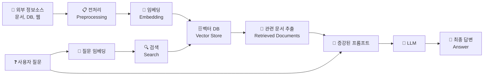

[← Part 1](./PART-1-README.md)

# CHAP-04 RAG의 원리와 장단점

## 📑 Index

- [첫째, LLM은 최신 정보에 대해서는 환각현상을 일으킨다](#첫째-llm은-최신-정보에-대해서는-환각현상을-일으킨다)
  - [(1) 학습 데이터 시점의 한계](#1-학습-데이터-시점의-한계)
  - [(2) 존재하지 않는 정보의 생성](#2-존재하지-않는-정보의-생성)
- [둘째, LLM의 환각현상은 일종의 본질적인 현상](#둘째-llm의-환각현상은-일종의-본질적인-현상)
  - [(1) 안드레 카파시의 관점: "LLM은 꿈꾸는 기계다"](#1-안드레-카파시의-관점-llm은-꿈꾸는-기계다)
  - [(2) LLM의 본질적 한계](#2-llm의-본질적-한계)
  - [(3) Transformer와 Attention의 역할: 점수 기반 단어 생성](#3-transformer와-attention의-역할-점수-기반-단어-생성)
  - [(4) 환각은 버그가 아닌 기본 동작의 일부](#4-환각은-버그가-아닌-기본-동작의-일부)
- [셋째, RAG는 LLM이 모르는 정보에 대한 답지를 주고 대답하게 하는 시스템](#셋째-rag는-llm이-모르는-정보에-대한-답지를-주고-대답하게-하는-시스템)
  - [(1) 지식 베이스 구축: 외부 정보 저장](#1-지식-베이스-구축-외부-정보-저장)
  - [(2) 검색 및 증강: 관련 정보 추출](#2-검색-및-증강-관련-정보-추출)
  - [(3) 신뢰도 높은 답변 생성: 환각 감소](#3-신뢰도-높은-답변-생성-환각-감소)
  - [(4) RAG 파이프라인 구조](#4-rag-파이프라인-구조)

---

### 첫째, LLM은 최신 정보에 대해서는 환각현상을 일으킨다

#### (1) 학습 데이터 시점의 한계

LLM은 특정 시점까지의 데이터로만 학습되므로, 그 이후의 새로운 정보(정책 변경, 새로운 제품, 최신 뉴스 등)에 대해 환각현상 발생

- 사례: 항공사 Air Canada의 챗봇이 실제로는 없는 "사후 유족 할인 정책"을 고객에게 안내 → 고소로 이어짐
- 사례: Cursor 고객 지원 AI가 없는 새 정책("동시 로그인 금지")을 안내 → 고객 해지 발생

#### (2) 존재하지 않는 정보의 생성

LLM이 없는 정보를 그럴듯하게 생성하려다가 존재하지 않는 인용, 정책, 사례를 만들어냄

- 사례: 변호사들이 AI가 생성한 존재하지 않는 판례를 법정에 제출 → 각 $3,000 벌금
- 사례: OpenAI의 Whisper가 의료 기록 전사 시 약 1.4%에서 존재하지 않는 약물명("hyperactivated antibiotics") 생성

### 둘째, LLM의 환각현상은 일종의 본질적인 현상

#### (1) 안드레 카파시의 관점: "LLM은 꿈꾸는 기계다"

LLM은 훈련 데이터의 확률 분포를 학습한 생성 모델

- 현실의 정확한 정보보다는 훈련 데이터에 기반한 그럴듯한 콘텐츠 생성

#### (2) LLM의 본질적 한계

훈련 데이터를 기반하여 생성하는 것이 LLM의 기본 동작 방식

- 현실과 일치하지 않을 수 있음 (완벽한 팩트 체크 불가능)

#### (3) Transformer와 Attention의 역할: 점수 기반 단어 생성

Attention 메커니즘은 입력의 각 요소에 대한 관련도 점수(weight) 계산

- 높은 점수를 받은 단어들을 기반으로 다음 토큰 생성
- 이는 통계적 패턴일 뿐, 실제 팩트 여부를 검증하지 않음
- 결과: 점수가 높지만 거짓일 수 있는 콘텐츠 생성

#### (4) 환각은 버그가 아닌 기본 동작의 일부

LLM의 설계상 피할 수 없는 특성

- 이를 극복하기 위해 **RAG(Retrieval-Augmented Generation)** 등장
- 외부 정보 검색을 통해 모델의 한계 보완 → RAG가 필요한 이유

### 셋째, RAG는 LLM이 모르는 정보에 대한 답지를 주고 대답하게 하는 시스템

#### (1) 지식 베이스 구축: 외부 정보 저장

LLM의 학습 데이터에 없는 최신 정보나 사내 문서/매뉴얼을 벡터 DB에 저장

- 외부 데이터소스(웹, 문서, DB 등)를 임베딩하여 검색 가능한 형태로 변환

#### (2) 검색 및 증강: 관련 정보 추출

사용자 질문을 받으면 지식 베이스에서 관련 정보 검색

- 검색된 정보를 프롬프트에 추가하여 LLM의 입력 증강 (Augmented)

#### (3) 신뢰도 높은 답변 생성: 환각 감소

LLM이 증강된 정보(검색 결과)를 바탕으로 답변 생성

- 훈련 데이터가 아닌 실제 정보 기반 → 거짓 정보 생성 위험 감소

#### (4) RAG 파이프라인 구조

