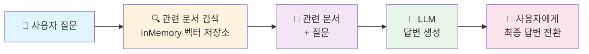

[← Part 1](./PART-1-README.md)

# CHAP-06 Langchain으로 구현하는 Basic RAG

## 📑 Index
- [첫째, Langchain 프레임워크](#첫째-langchain-프레임워크)
  - [(1) Langchain 개요](#1-langchain-개요)
  - [(2) Langchain 버전별 업데이트](#2-langchain-버전별-업데이트)
  - [(3) Langchain과 LangGraph 비교](#3-langchain과-langgraph-비교)
- [둘째, 실습-01 Langchain으로 구현하는 Basic RAG](#둘째-실습-01-langchain으로-구현하는-basic-rag)
  - [(1) 환경  설정 및 기본 구성](#1-환경-설정-및-기본-구성)
  - [(2) RAG 아키텍처 이해](#2-rag-아키텍처-이해)
  - [(3) 문서 로딩](#3-문서-로딩)
  - [(4) 텍스트 분할](#4-텍스트-분할)
  - [(5) 임베딩 및 벡터 저장소](#5-임베딩-및-벡터-저장소)
  - [(6) 2-Step RAG 구현](#6-2-step-rag-구현)
  - [(7) RAG Agent 구현](#7-rag-agent-구현)
  - [(8) 실습: 질의응답 테스트](#8-실습-질의응답-테스트)

## 첫째, Langchain 프레임워크

### (1) Langchain 개요

- **등장**: 2022년 Harrison Chase에 의해 개발된 오픈소스 프레임워크
- **정의**: LLM 기반 애플리케이션 구축을 위한 통합 프레임워크
- **핵심 목표**: 복잡한 LLM 워크플로우를 모듈화하여 간편한 구현 제공
- **주요 구성 요소**: Chains(작업 흐름), Agents(자율 의사결정), Memory(대화 맥락), Tools(외부 도구 연동)
- **다중 LLM 지원**: OpenAI, Anthropic, Hugging Face 등 다양한 LLM 프로바이더 통합
- **외부 도구 연동**: 검색 엔진, 데이터베이스, API 등과 자유로운 연결
- **사용 사례**: 챗봇, Q&A 시스템, 에이전트, RAG 시스템, 데이터 분석 등
- **생태계**: 빠르게 성장하는 커뮤니티와 풍부한 플러그인 지원
- **공식 문서**: [LangChain Documentation](https://python.langchain.com/docs)

### (2) Langchain 버전별 업데이트

#### v0.0.x (2022~2023년 초)
- 기초적인 Chains, Agents, Memory 구현
- 제한된 LLM 프로바이더 지원
- 빠른 기능 추가로 인한 API 불안정성

#### v0.1.0 (2023년 중반)
- 너무 많은 의존성 문제 해결
- 모듈 구조 개편 (langchain-core 분리)
- 문서화 및 테스트 강화
- 설치 시간 및 의존성 크기 대폭 감소

#### v0.2.0 이후 (2023년 말~2024년)
- 성능 최적화 (임베딩 캐싱, 배치 처리 개선)
- LCEL (LangChain Expression Language) 도입으로 선언형 파이프라인 구성
- 더 나은 에러 처리 및 디버깅 도구
- 에코시스템 확장 (langchain-community, langchain-experimental)
- 프로덕션 환경 지원 강화 (모니터링, 로깅)

#### 현재 버전 (2024년~)
- **모듈화**: 핵심 기능과 커뮤니티 통합 분리
- **안정성**: LLM 애플리케이션 프로덕션 운영 지원
- **성능**: 비용 최적화 및 응답 속도 개선
- **확장성**: 다양한 LLM, 도구, 데이터 소스 통합

### (3) Langchain과 LangGraph 비교

#### LangChain의 특징
- **목적**: LLM 통합 프레임워크
- **워크플로우**: 선형적/순차적 실행 (Chains)
- **복잡도**: 단순하고 직관적인 구조
- **제어 흐름**: 기본 라우팅, 조건부 로직 제한적
- **사용 사례**: 챗봇, Q&A, 간단한 RAG, 기본 에이전트
- **학습 곡선**: 낮음

#### LangGraph의 특징
- **목적**: LangChain 기반 상태 머신 프레임워크
- **워크플로우**: 그래프 기반 (노드, 엣지, 루프)
- **복잡도**: 복잡한 다단계 워크플로우 표현 가능
- **제어 흐름**: 루프, 분기, 조건부 로직, 상태 관리 정밀 제어
- **사용 사례**: 복잡한 에이전트, 멀티 턴 대화, 동적 의사결정 흐름
- **학습 곡선**: 높음

#### 선택 기준
| 선택지 | 사용 시점 |
|--------|----------|
| **LangChain** | 간단한 RAG, 기본 챗봇, 빠른 프로토타이핑 필요 시 |
| **LangGraph** | 복잡한 에이전트, 정밀한 제어 흐름, 프로덕션급 시스템 필요 시 |

---

## 둘째, 실습-01 Langchain으로 구현하는 Basic RAG

### (1) 환경 설정 및 기본 구성

#### 📌 학습 목표
- Langchain RAG 시스템을 위한 필수 패키지 설치 및 구성
- OpenAI API 연동 설정

#### 🎓 스터디 노트 및 질문

> 여기에 학습하며 생긴 질문들을 기록하세요.

### (2) RAG 아키텍처 이해

#### 📌 학습 목표
- RAG(Retrieval-Augmented Generation)의 핵심 개념 이해
- LangChain에서 소개하는 RAG 아키텍처 종류 비교

#### 🎓 스터디 노트 및 질문

> **"정적인 지식(Knowledge Cutoff)"에 대한 깊이 있는 이해**

1. 모델의 학습 데이터가 특정 시점에서 고정됨
   - GPT-4o: 2024년 4월 기준 학습 완료
   - Claude 3.5: 2024년 8월 기준
   - 학습 후 발생한 새로운 정보(뉴스, 최신 연구, 업데이트)를 모름

2. 웹검색 기능도 실시간이 아님
   - 모든 웹 페이지를 실시간 수집할 수 없음
   - 웹 수집 속도는 주기적 크롤링 (며칠~몇 주 단위)
   - 따라서 극도로 최신의 정보는 여전히 미흡

3. 비공개/내부 문서는 웹검색으로 절대 커버 불가
   - 회사 내부 DB, 사내 매뉴얼, 기술 문서
   - 개인 데이터, 고객 정보 등 민감한 자료
   - 이런 자료들을 LLM이 활용하려면 RAG가 필수

4. RAG는 쿼리 시점에 관련 외부 지식을 동적으로 추가
   - 검색 후 생성(Retrieval-Augmented Generation) 방식
   - 모델의 학습 범위를 실시간으로 확장
   - 비공개 자료, 최신 정보, 특정 도메인 데이터 모두 활용 가능

**추가 학습 질문:**
- 웹검색 기능이 있는 ChatGPT는 왜 RAG가 필요한가?
- 내부 데이터가 아닌 공개 정보라면 RAG 대신 웹검색으로 충분하지 않나?
- 웹 크롤링 속도의 한계는 구체적으로 어떻게 극복하는가?

### (3) 문서 로딩

#### 📌 학습 목표
- LangChain Document Loader를 활용한 PDF 문서 로드
- 다양한 소스에서 데이터 로드하는 방법 학습

#### 🎓 스터디 노트 및 질문

> 여기에 학습하며 생긴 질문들을 기록하세요.

### (4) 텍스트 분할

#### 📌 학습 목표
- RecursiveCharacterTextSplitter를 사용한 텍스트 청크 분할
- chunk_size와 chunk_overlap의 최적값 결정 방법

#### 🎓 스터디 노트 및 질문

> **RecursiveCharacterTextSplitter 이해하기**

**역할**: 긴 문서를 LLM의 컨텍스트 윈도우에 맞는 작은 청크로 분할

**핵심 파라미터:**
- `chunk_size`: 각 청크의 최대 문자 수 (일반적으로 500~2000)
- `chunk_overlap`: 청크 간 겹치는 문자 수 (문맥 연속성 유지, 보통 chunk_size의 10~20%)
- `add_start_index`: 원본 문서에서의 시작 위치 추적 여부

**chunk_size는 "정확한 값"이 아니라 "최대값":**

1. **재귀적 구분자 기반 분할** — chunk_size=1000으로 설정해도 정확히 1000자 청크가 나오지 않음
   - 예: DeepSeek_OCR_paper.pdf에서 첫 청크는 918자 (1000자 미만)

2. **기본 separators 사용** — ["\n\n", "\n", " ", ""] 순서대로 시도
   - 먼저 단락("\n\n")으로 분할 시도 → 너무 크면 줄 바꿈("\n")으로 재분할
   - 여전히 크면 공백(" ")으로 분할, 최후의 수단으로 문자 단위("")로 분할

3. **구분자 경계 존중** — 의미 있는 단위 유지 우선순위
   - chunk_size를 약간 작게 해도 문장/단락 경계를 유지하는 것이 더 중요
   - 문맥 손실 없이 자연스러운 청크 생성

**왜 텍스트를 분할해야 할까?**

1. **검색 정확도 향상** — 작은 청크에서 관련 정보를 더 정확하게 찾을 수 있음
2. **컨텍스트 윈도우 제한** — LLM은 한 번에 처리할 수 있는 토큰 수에 제한이 있음
3. **비용 효율성** — 전체 문서 대신 관련 청크만 LLM에 전달하여 API 비용 절약

**chunk_overlap의 중요성:**
- `chunk_overlap`을 설정하지 않으면 청크 경계에서 문맥이 끊김
- 예: "The quick brown fox jumps over | the lazy dog" → "the"가 어느 청크에도 없을 수 있음
- overlap을 설정하면 경계 부근의 내용이 두 청크에 중복 포함되어 문맥 손실 방지

**추가 학습 질문:**
- chunk_size와 chunk_overlap의 최적값은 어떻게 결정하나?
- 다양한 문서 타입(PDF, 표, 코드)에 따라 분할 전략이 달라져야 하나?

**metadata.get() 메서드의 두 인자 이해**

```python
doc.metadata.get('page', 'N/A')
```

- **첫 번째 인자** (`'page'`): 찾을 키(key) 이름
- **두 번째 인자** (`'N/A'`): 해당 키가 없을 때의 기본값(default value)

**동작:**
- 만약 `doc.metadata`에 `'page'` 키가 존재 → 그 값 반환
- 만약 `'page'` 키가 없음 → 기본값 `'N/A'` 반환 (KeyError 발생 안 함)

**왜 이렇게 할까?** 모든 문서가 같은 메타데이터를 가지지 않기 때문
- 어떤 PDF는 페이지 정보가 있고, 어떤 건 없을 수 있음
- `.get(key, default)`는 안전하게 처리하는 파이썬 표준 방식

### (5) 임베딩 및 벡터 저장소

#### 📌 학습 목표
- OpenAI Embeddings를 사용한 텍스트 벡터화
- InMemoryVectorStore를 활용한 벡터 저장 및 유사도 검색

#### 🎓 스터디 노트 및 질문

> 여기에 학습하며 생긴 질문들을 기록하세요.

### (6) 2-Step RAG 구현

#### 📌 학습 목표
- 검색 → 생성의 기본 RAG 파이프라인 구현
- Retriever와 LLM을 연결한 RAG 시스템 구축

#### 🎓 스터디 노트 및 질문

> **2-Step RAG 파이프라인**



**파이프라인 흐름:**

1. **Step 1: 검색(Retrieval)** — 사용자 질문을 임베딩하여 벡터 저장소에서 관련 문서 청크 검색 (k=4 등)
2. **Step 2: 생성(Generation)** — 검색된 문서 + 사용자 질문을 LLM에 전달하여 답변 생성
3. **최종 반환** — 생성된 답변 + 참조 문서 메타데이터를 사용자에게 반환

**추가 학습 질문:**
- 검색 단계에서 k 값(반환 문서 개수)을 다르게 하면 결과가 어떻게 달라지나?
- 검색된 문서가 없을 때 (empty result) 처리는 어떻게 하나?

### (7) RAG Agent 구현

#### 📌 학습 목표
- LangChain의 최신 `create_agent` API 활용
- `@tool` 데코레이터를 사용한 Agentic RAG 구현
- LLM 에이전트가 동적으로 검색을 결정하는 방식 이해

#### 🎓 스터디 노트 및 질문

> **에이전트 스트리밍과 pretty_print() 메서드**

```python
for event in rag_agent.stream(
    {"messages": [{"role": "user", "content": question}]},
    stream_mode="values"
):
    event["messages"][-1].pretty_print()
```

**코드 분석:**

**1. `rag_agent.stream()` — 스트리밍 방식 실행**
- 에이전트의 각 단계(생각→검색→답변)를 실시간으로 감시
- 전체 응답을 기다리지 않고 중간 과정도 확인 가능

**2. `stream_mode="values"` — 완전한 상태 반환**
- 각 단계마다 전체 메시지 히스토리를 반환
- 진행 상황을 추적할 수 있음

**3. `event["messages"][-1]` — 최신 메시지만 추출**
- 메시지 리스트에서 마지막 메시지 선택 (가장 최신)
- 불필요한 과거 메시지는 제외

**4. `.pretty_print()` — 메시지를 예쁘게 포맷하여 출력**
- **역할 표시**: assistant/user/tool 구분
- **내용 들여쓰기**: 읽기 쉬운 형식으로 정렬
- **시각적 구분**: 터미널에서 각 메시지를 명확하게 구분
- **도구 정보**: 에이전트가 사용한 도구(retrieve_context 등)를 별도 표시
- **실시간 확인**: 스트리밍 중간에 각 단계별 응답을 바로 확인

**왜 pretty_print() 사용?** 
- 기본 print()는 메시지 딕셔너리 구조를 그대로 출력해서 읽기 어려움
- pretty_print()는 에이전트의 "생각 과정"을 사람이 이해하기 쉽게 정렬

**추가 학습 질문:**

**1️⃣ stream_mode="values" vs stream_mode="updates" 비교**

| 항목 | `stream_mode="values"` | `stream_mode="updates"` |
|------|----------------------|------------------------|
| **반환 내용** | 매 단계마다 전체 메시지 히스토리 | 변경된 부분만 (증분/diff) |
| **데이터 양** | 크다 (반복되는 메시지 포함) | 작다 (신규 메시지만) |
| **사용 사례** | 완전한 상태 추적 필요 시 | 네트워크 효율성 중요 시 |
| **예시** | 메시지 1,2,3 → 메시지 1,2,3,4 | 메시지 4 (새로 추가된 것만) |

**2️⃣ pretty_print() 없이 원본 데이터 보기**

```python
# 방법 1: 원본 딕셔너리 구조 확인
for event in rag_agent.stream({"messages": [{"role": "user", "content": question}]}):
    print(event["messages"][-1])  # 딕셔너리 형태로 출력

# 방법 2: JSON 형식으로 더 깔끔하게
import json
for event in rag_agent.stream({"messages": [{"role": "user", "content": question}]}):
    msg = event["messages"][-1]
    print(json.dumps({
        "type": msg.type,
        "content": msg.content,
        "role": getattr(msg, 'role', 'unknown')
    }, indent=2, ensure_ascii=False))

# 방법 3: 특정 속성만 추출
for event in rag_agent.stream({"messages": [{"role": "user", "content": question}]}):
    msg = event["messages"][-1]
    print(f"Role: {msg.get('role', 'N/A')}")
    print(f"Content: {msg.get('content', 'N/A')[:100]}...")
```

**💡 언제 뭘 사용할까?**
- **pretty_print()** — 디버깅, 결과 확인할 때 (읽기 쉬움)
- **원본 데이터** — 프로그래밍으로 처리, 로깅, 데이터 저장할 때

### (8) 실습: 질의응답 테스트

#### 📌 학습 목표
- 2-Step RAG와 Agentic RAG의 실제 동작 비교
- 다양한 쿼리에 대한 답변 품질 평가

#### 🎓 스터디 노트 및 질문

> 여기에 학습하며 생긴 질문들을 기록하세요.

